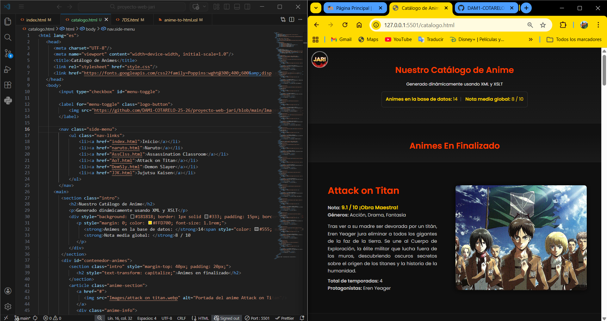
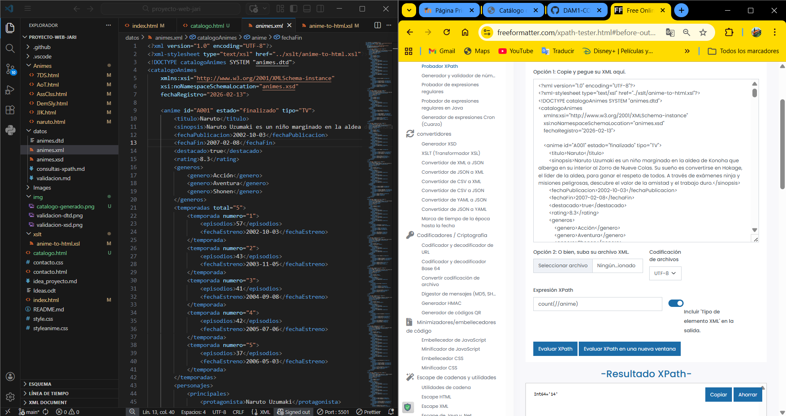

# JARI - Mundo Anime
Bienvenido a **JARI**, una plataforma web dedicada a la documentación y valoración del anime. Este proyecto se basa en dar información de cada anime en cada una de sus páginas web.

## Objetivo y Contenidos
El propósito es servir como una enciclopedia interactiva con dos enfoques:
* **Exploración:** Una portada atractiva para descubrir nuevas series.
* **Profundidad:** Fichas técnicas con sinopsis, tablas de episodios, listas de personajes y sistemas de valoración.

> **Público Objetivo:** Usuarios **mayores de 16 años**, debido a la complejidad de las tramas y contenidos.

## Identidad Visual y Diseño (CSS)
El proyecto mantiene una estética global (Dark Mode + Acentos Cálidos), pero implementa **dos layouts distintos** según la funcionalidad de la página.

### 1. Estilos Globales (Comunes)
* **Tipografía:** 'Poppins', sans-serif.
* **Paleta de Colores:**
    * 🔴 `#ff3c00` (Naranja Rojizo): Color principal de marca, títulos y bordes.
    * 🟡 `#FFD700` (Dorado): Enlaces y destacados.
    * ⚫ `#111111` / `#181818`: Fondos oscuros para reducir la fatiga visual.
* **Navegación:** Menú lateral oculto (Sidebar) accesible mediante un botón de logo fijo (`.logo-button`) en la esquina superior izquierda.

### 2. Layout de Portada (`index.html`)
Diseño basado en el **patrón "Zig-Zag"**:
* Secciones alternas (Imagen Izquierda / Imagen Derecha).
* Imágenes grandes y títulos llamativos.

### 3. Layout de Ficha Técnica (`[anime].html`)
Diseño tipo **"Dashboard"** estructurado para mostrar grandes cantidades de datos:
* **Contenedor Principal (`.main-container`):** Posee un `padding-left: 110px` para acomodar el logo fijo sin superposiciones.
* **Grilla Superior (`.top-section`):** División 2:1 entre la información (Sinopsis + Datos) y la imagen de portada.
* **Tablas Estilizadas:** Cabeceras rojas (`thead`) y filas alternas para facilitar la lectura de episodios/temporadas.
* **Distribución de Personajes (`.characters-grid`):** Distribución en 3 columnas (Principales, Secundarios, Villanos).
* **Zona de Interacción:** Sección inferior con caja de comentarios y valoración por estrellas.

## ⚙️ Fase 4: Transformación XML y Consultas (XSLT & XPath)

En esta fase, el proyecto hemos generado contenido web de forma dinámica a partir de nuestra base de datos XML utilizando **XSLT** y extrayendo información mediante **XPath**.

### Archivos involucrados
* **XML Original:** `/datos/animes.xml`
* **Hoja de transformación:** `/xslt/anime-to-html.xsl`
* **HTML Generado:** `/catalogo.html`
* **Consultas:** `/datos/consultas-xpath.md`

### Funcionalidades XSLT Implementadas
Se ha desarrollado la hoja de transformación `/xslt/anime-to-html.xsl` que genera el archivo `catalogo.html`. Se han empleado todos los elementos requeridos (`<xsl:template>`, `<xsl:apply-templates>`, `<xsl:for-each>`, `<xsl:value-of>`, `<xsl:sort>`, `<xsl:if>`, `<xsl:choose>`, `<xsl:attribute>`) y se han integrado las siguientes **funcionalidades avanzadas**:

* 📂 **Agrupación (Muenchian):** Los animes se dividen visualmente según su estado (`emisión` o `finalizado`) usando `<xsl:key>` y la función `generate-id()`.
* 📊 **Ordenación:** Dentro de cada grupo, las series se ordenan por su valoración (`rating`) de forma descendente mediante `<xsl:sort>`.
* 🧮 **Cálculos Estadísticos:** Se emplea XPath puro para mostrar en la cabecera de la página el número total de animes (`count()`) y la nota media global de la plataforma (`round(sum() div count())`).
* 🎨 **Formato Condicional:** Se utiliza `<xsl:choose>` para destacar las notas con distintos colores (🟡 Dorado para Obras Maestras >= 8.8, 🟢 Verde para notables y 🟠 Naranja para el resto).

### 📸 Evidencias y Ejecución
Para visualizar el resultado de la transformación, existen dos opciones:
1. **Dinámica:** Abrir `/datos/animes.xml` en un navegador web compatible para que interprete el XSLT en tiempo real.
2. **Estática:** Procesar el XSLT y el XML para generar el archivo HTML estático (`/catalogo.html`) presente en la raíz.

*Resultado de la transformación visual:*


*Prueba de consultas XPath:*


## Estructura del Sitio Web### Mapa del Sitio

### Mapa del Sitio

```text
JARI (Raíz del proyecto)
│
├── Animes/                 (Fichas técnicas individuales)
│   ├── 7DS.html
│   ├── AoT.html
│   ├── AssClss.html
│   ├── DemSly.html
│   ├── JJK.html
│   └── naruto.html
│
├── datos/                  (Base de datos y validaciones)
│   ├── animes.dtd
│   ├── animes.xml
│   ├── animes.xsd
│   ├── consultas-xpath.md
│   └── validacion.md
│
├── Images/                 (Recursos gráficos web)
│   └── (Imágenes de las portadas de los 14 animes y logos)
│
├── img/                    (Capturas de pantalla y evidencias)
│   ├── catalogo-generado.png
│   ├── validacion-dtd.png
│   ├── validacion-xsd.png
│   └── xpath-testing.png
│
├── xslt/                   (Hojas de transformación)
│   └── anime-to-html.xsl
│
├── catalogo.html           (HTML generado dinámicamente)
├── contacto.css
├── contacto.html           (Formulario)
├── idea_proyecto.md
├── ideas.odt
├── index.html              (Inicio - Diseño Zig-Zag)
├── README.md               (Documentación del proyecto)
├── style.css               (CSS global y de index)
└── styleanime.css          (CSS específico de las fichas)