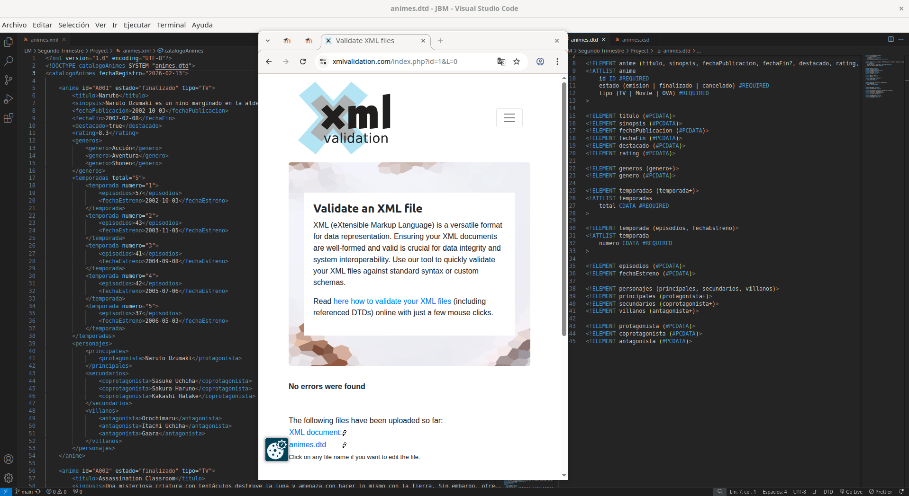
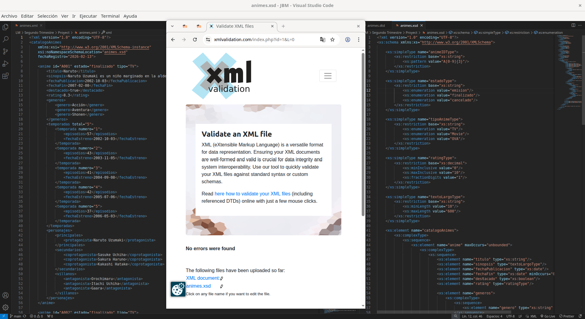

# Validación del archivo animes.xml

## 1. Herramientas utilizadas
### Validación DTD y XSD
* **Herramienta:** xmlvalidation.com 

## 2. Proceso de validación
### Validación DTD
**Pasos ejecutados:**
1.  Se subío el XMl con la vinculación al DTD mediante la declaración `<!DOCTYPE catalogoAnimes SYSTEM "animes.dtd">` .
2.  Se subío el DTD y se inició la validación.
3.  **Resultado:** Aparición del mensaje; "No errors were found".

### Validación XSD
**Pasos ejecutados:**
1.  Se subío el XML y se vinculó el esquema XSD mediante el atributo `xsi:noNamespaceSchemaLocation="animes.xsd"` en la etiqueta raíz.
2.  Se subío el XSD y se inició la validación.
3.  **Resultado:** Aparición del mensaje; "No errors were found".

## 3. Decisiones de diseño

### ¿Por qué usar elementos vs atributos?
* **Uso de Atributos (`id`, `estado`, `tipo`, `numero`):** Se utilizaron para metadatos, identificadores únicos y valores enumerados.
* **Uso de Elementos (`titulo`, `sinopsis`, `personajes`, `genero`):** Se utilizaron para el contenido semántico, textos extensos y estructuras jerárquicas complejas.

### Restricciones XSD aplicadas
1.  **Restricción de Patrón (`xs:pattern`) en el ID:**
    * **Justificación:** Se obliga a que el atributo `id` siga el formato `A` seguido de tres dígitos, estandarizando así los identificadores y evitando errores de formato.

2.  **Restricción de Rango Numérico (`xs:minInclusive` / `xs:maxInclusive`) en el Rating:**
    * **Justificación:** El rating se ha limitado a un valor decimal entre 0 y 10. Para que solo se puedan poner notas lógicas.

3.  **Restricción de Longitud de Texto (`xs:minLength` / `xs:maxLength`) en la Sinopsis:**
    * **Justificación:** Se exige una longitud mínima de 10 caracteres y máxima de 600. Esto asegura que las sinopsis sean descriptivas y útiles, evitando textos vacíos o excesivamente largos.

4.  **Restricción de Enumeración (`xs:enumeration`) en el Estado y Tipo:**
    * **Justificación:** El atributo `estado` solo permite los valores "emision", "finalizado" o "cancelado". Esto evita errores tipográficos.

5.  **Restricción de Decimales (`xs:fractionDigits`) en el Rating:**
    * **Justificación:** Se limita a 1 solo dígito decimal para mantener una estandarización de las notas.